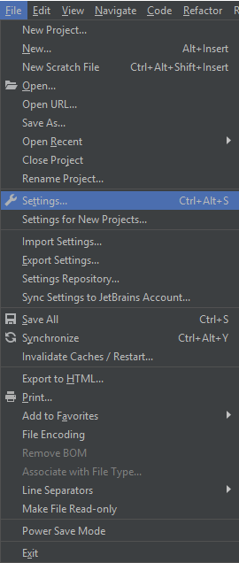
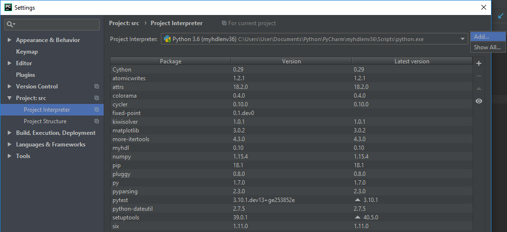
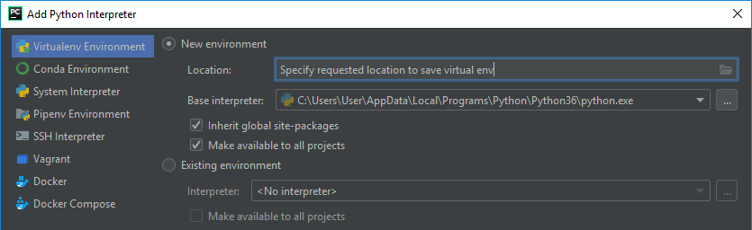

#Installation of the enviroment on Windows  
Instructions for MyHDL installation on Windows:

1. Download and install newest version of python3.6 for Windows (3.6.7 as of last tutorial update): 
    
    - https://www.python.org/downloads/release/python-367/
  
2. Setup PATH variable to Python install directory (possibly done during Python installation):  

    - System Properties -> Enviroment Variables -> Path -> Edit -> New     
    - Enter %PYTHONPATH% from AppData  
    
3. Download & install MyHDL package version 0.10:

    - https://github.com/myhdl/myhdl  
    - Clone or download -> Download  
    `%MyHDL_PATH%/myhdl/test/core >> python setup.py install`  

4. Install other necessary packages:

    - pytest: https://github.com/pytest-dev/pytest  
    `>> %PYTEST_DIR% > python setup.py install`
    - cpython: https://www.lfd.uci.edu/~gohlke/pythonlibs/#cython  
    `>> %FILE_DIR% > python -m pip install %CPYTHON .WHL FILE%`
    - numpy:  
    `>> python -m pip install numpy`
    - matplotlib:
    `>> python -m pip install matplotlib`

5. Download & install a Python IDE, recommended one is PyCharm:
    - https://www.jetbrains.com/pycharm/download/#section=windows  

6. Create a virtual environment with appropriate modules enabled.  
    - Step 1: Enter project settings.  
      
    - Step 2: Navigate to virtual environment creation.   
      
    - Step 3: Create new environment. As long as python executable path is correct, modules added afterwards should appear automatically.  
      
